# SKN12-1ST-4TEAM 🚀

## 프로젝트 소개 🚀

### 🚗 자동차 등록은 왜 해야 하는 걸까?

>우리는 그 이유에 대해 주목했습니다.  

물론 기능 구현은 기본이고 말이죠 😉  

📌 **우리를 내내 힘들게 했던 데이터의 정렬, 정렬, 정렬... 😭**  

---

## 🚘 자동차 등록 현황이 어디에 쓰이는지 알고 계신가요? 🤔❓

**환경, 세수 확보, 교통정보, 교통량 예측 등...**  
생각보다 많은 곳에서 활용되고 있었습니다. 💡  

> **그 결과, 자동차 등록 현황이
> 우리가 상식적으로 갖고 있는 인구 밀집도와 
> 비슷한 결과를 보인다는 걸 알게 됐죠!** ❗  

---

## 🌍 세계 곳곳에서 사용되고 있는 자동차 등록 현황! 🚗🚒🚌🚓

> **국토통계와 나라지표를 통해  
> 우리나라의 자동차 등록 현황에 대해서도 알아볼까요?** 🏃‍♂️  

---

# 🎈 팀원 소개

| 팀원 1 | 팀원 2 | 팀원 3 | 팀원 4 | 팀원 5 |
|:------:|:------:|:------:|:------:|:------:|
|  |  |  |  |  |
| 이석원 | 이용규 | 이정민 | 이준석 | 박슬기 |
| StreamLit | Crawling | Crawling | Mapping | PM, Crawling |  

---

# 🎯 프로젝트 목표

## ✅ 자동차 등록 현황의 시각화

- ✅ 자동차 등록 현황 데이터 크롤링  

- ✅ 등록 현황 데이터의 차트 및 지도 표현  

---

# 📌 구상 및 기획

## 📊 국토교통 통계누리 및 E-나라지표 데이터 크롤링  

국도교통 통계누리

E-나라지표

## 🗺️ 시각적으로 볼 수 있는 차트 및 지도 자료 첨부  

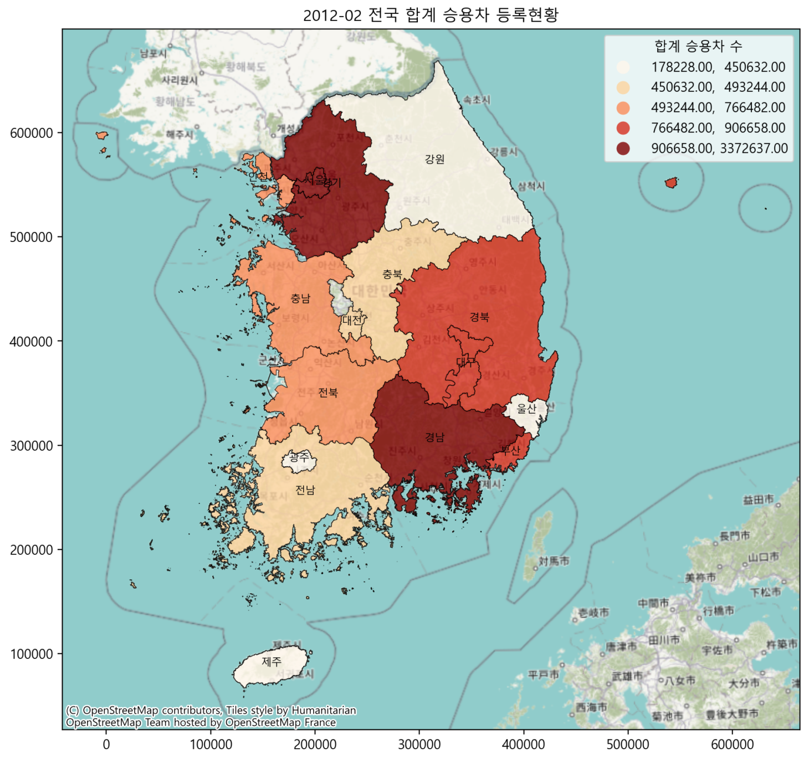

## 📝 화면 설계서 작성  

---

# 🛠 사용한 툴

---

# 🏗 ERD 구조  

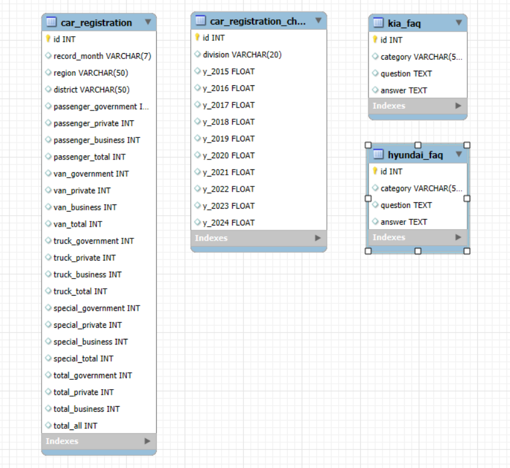
## vehicle_db
### car_registration
- 국도 교통 통계누리 크롤드 데이터 관리
## vehicle_chart
### car_registration_chart
- E-나라지표 크롤드 데이터 관리
## faq_db
### hyundai_faq
- 현대 FAQ 크롤드 데이터 관리
### kia_faq
- 기아 FAQ 크롤드 데이터 관리

---

# 📋 테이블 명세서  

1. car_registration

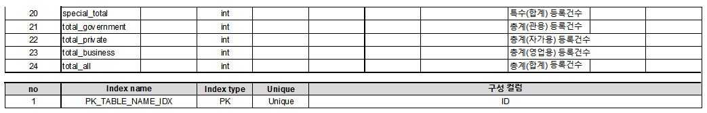
3. car_registration_chart
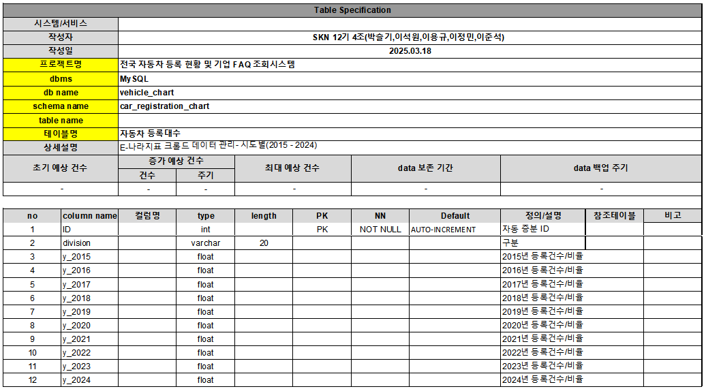
5. hyundai_faq
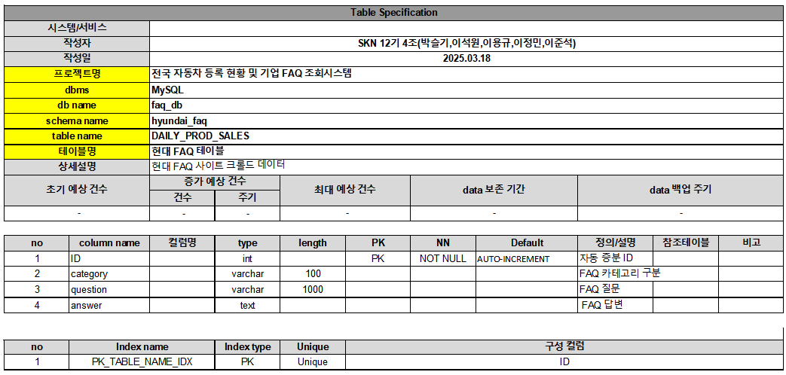
6. kia_faq
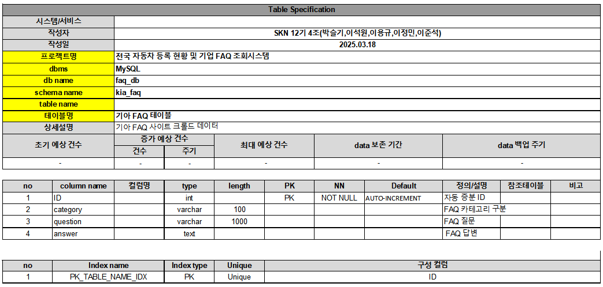

---

# 🎬 프로젝트 결과 (StreamLit UI)  
|홈화면이미지1|홈화면이미지2|
|:---:|:---:|
|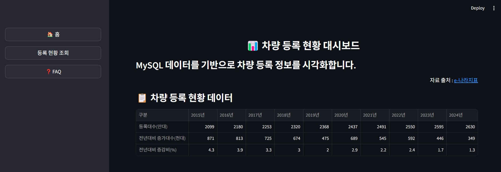|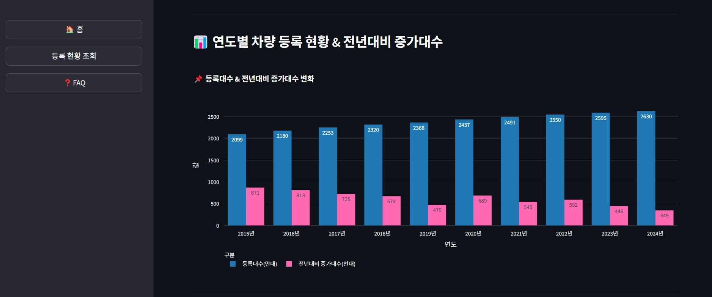| 
|홈화면이미지3|조회화면이미지1|
|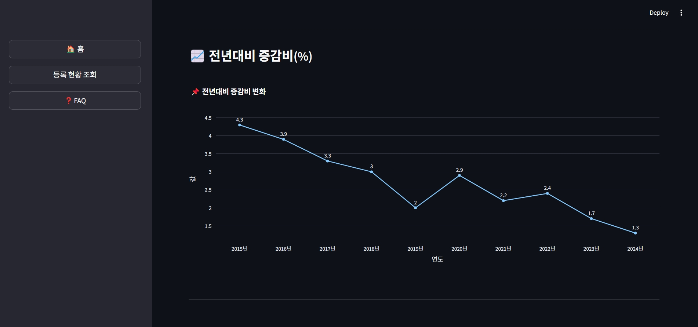|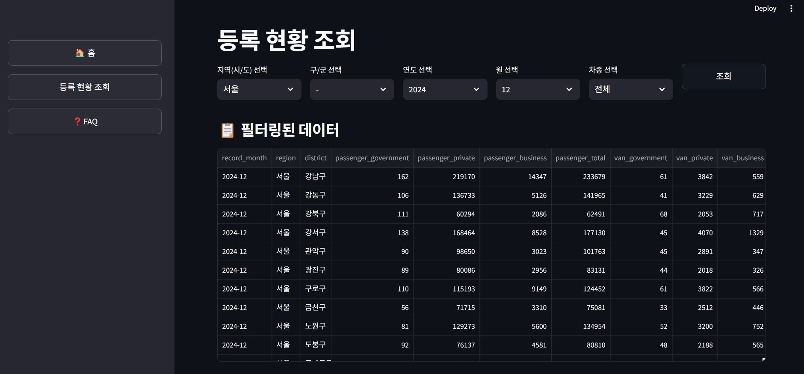|
|조회화면이미지2|조회화면이미지3|
|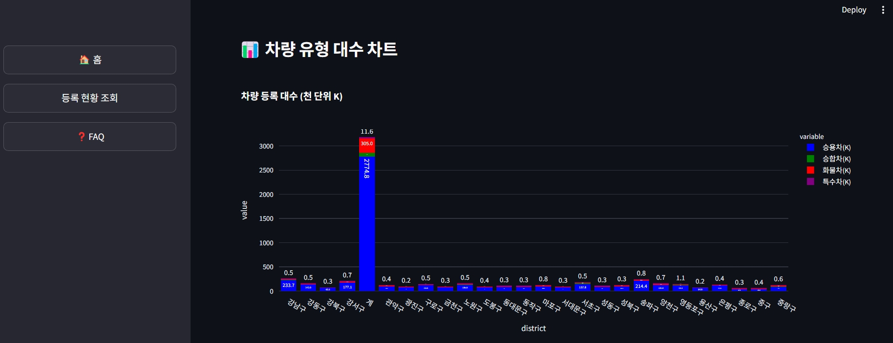|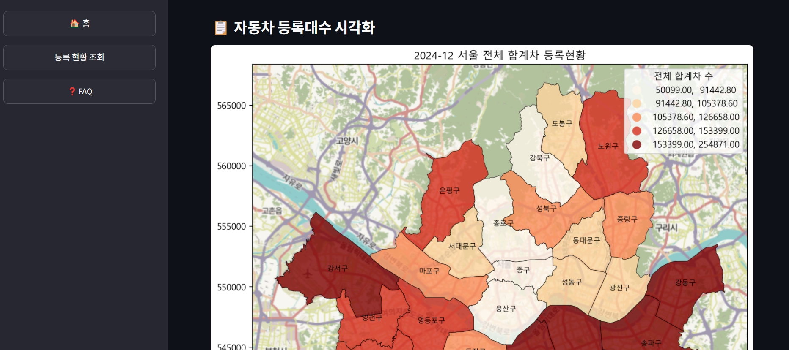|
|FAQ화면이미지1|FAQ화면이미지2|
|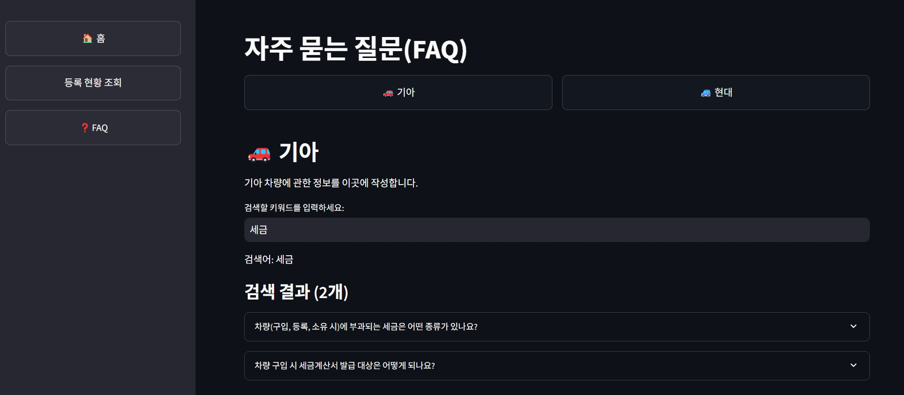|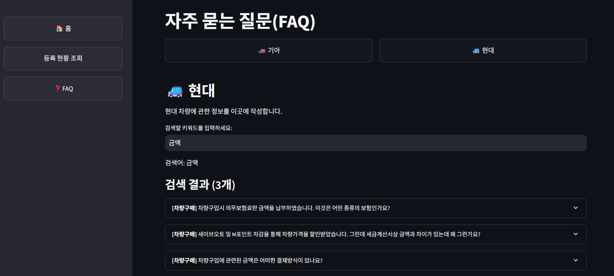|

---

# 📢 과제 후 소감  

> 어쨌건.... 해냈어....!!

| 팀원 | 역할 | 소감 |
|:----:|:----:|:----|
| 이석원 | StreamLit | 프로젝트는 항상 나에게 부족함을 느끼게 해주지만 원동력을 주기도 한다. 2일이라는 짧은 시간이었지만 팀원분들과 같이 작품을 완성했다는 점에서 이번 프로젝트는 성공적이었다고 생각한다. 좋은 팀원분들이라 좋았고 많은 것을 배웠다. |
| 이용규 | Crawling | 아직 크롤링이나 streamlit같은 최근에 학습한 내용이 익숙치않았는데, 다른 조원분들이 많이 도와주셔서 크롤링작업을 마칠수 있었다. 크롤링작업중에 페이지를 자동으로 넘기는 버튼을 설정하는 부분이 잇었는데, 조건문을 여러번 삽입하면서 해결해야한다는게 복잡하면서도 흥미로웠다. 그밖에도 데이터베이스, 웹사이트크롤링, 파이썬 코드작업등을 연계해서 작업하는 부분이 프로젝트를 통해 어느정도 익숙해진것같아서 그부분이 프로잭트를 통해 얻어가는 부분인것같다. 많이부족한데 도와주신 다른 조원분들에게 고마움을 느낀다. 다음 프로잭트 전에는 코딩능력을 빠르게 향상시켜야할 것 같다. |
| 이정민 | Crawling | 전 말하는 감자여서 웹크롤링 하나 맡은 것도 힘들었는데 옆에서 많이 도와주셔서 잘 해낼 수 있었습니다. 하루종일 붙잡고 있어도 결국 해결하고 퇴근하니 기분 좋더라고요. 그리고 능력자 팀원분들이 덕분에 프로젝트를 잘 마칠 수 있었던 것 같습니다. 모두 수고하셨습니다! |
| 이준석 | Mapping | 다들 2주 수업하고 첫 프로젝트라곤 믿을 수 없을 정도로 날아다니셔서 따라가기에도 벅찼지만 그 과정에서 내가 모르는 부분을 찾아가며 맡은 부분을 끝내고, 각자 협력하며 결과물을 합치는 과정에서 나 역시 성장함을 느낄 수 있게 되어 보람차다 |
| 박슬기 | PM, Crawling | 전체적인 기획 및 데이터 크롤링, 팀원 서포트를 담당했습니다. 국토누리 사이트 크롤링이 제일 어려웠습니다.. 누가 만들었냐 진짜..  어쩌다보니 PM역할을 맡게 되었는데, 믿고 잘 따라와준 팀원들에게 정말 감사합니다.  담부터는 그냥 팀원할래요...ㅠㅠ|
