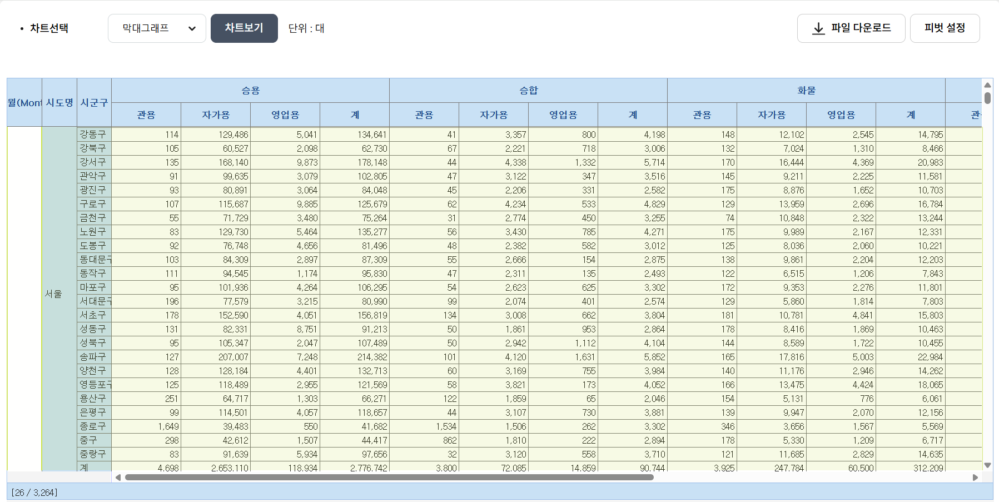
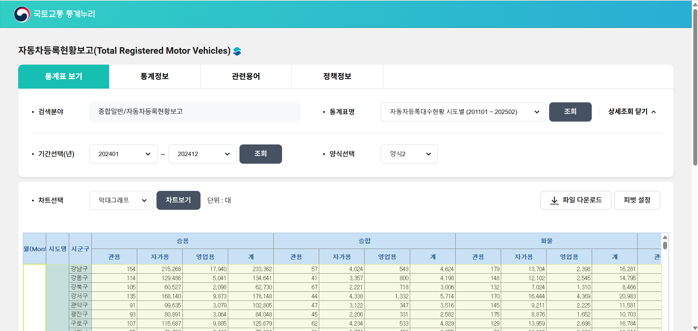
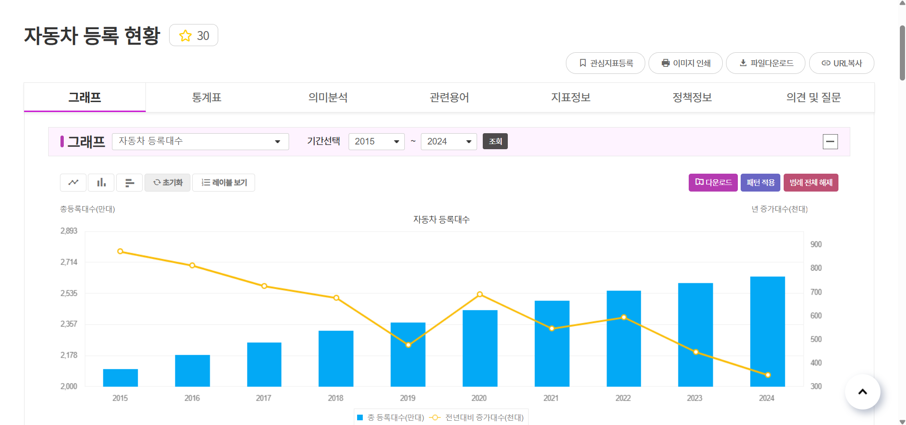
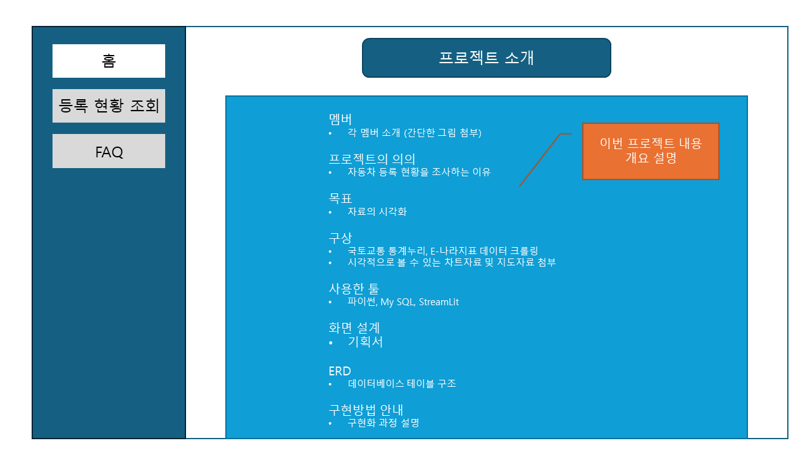
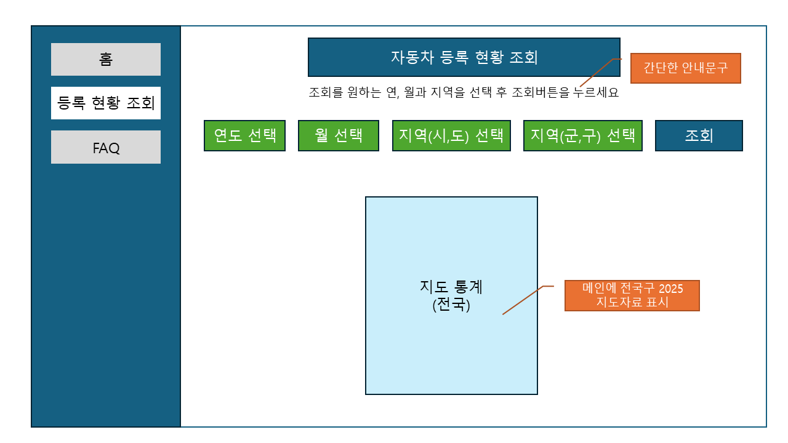
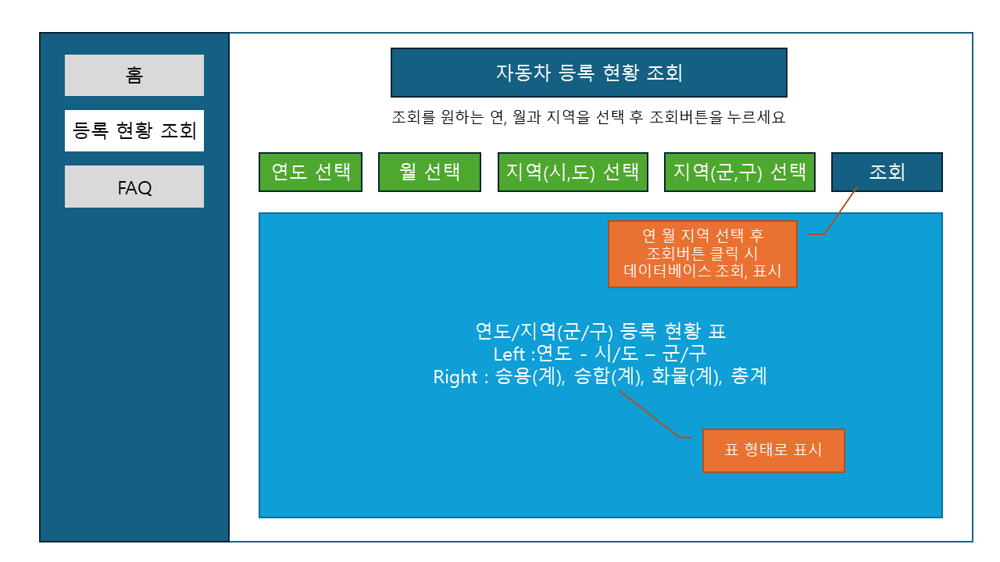
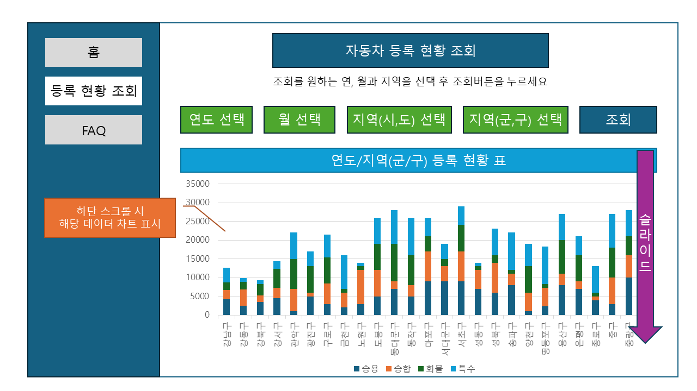
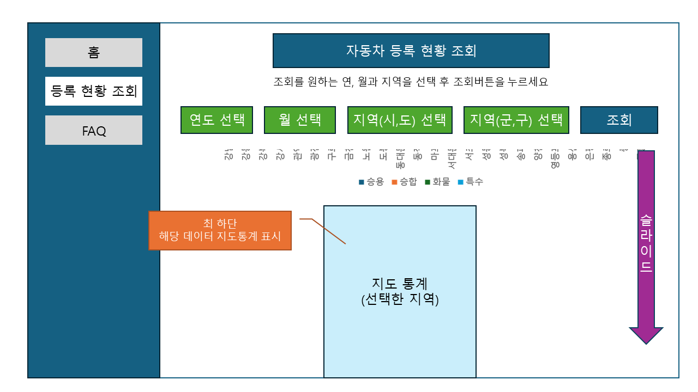
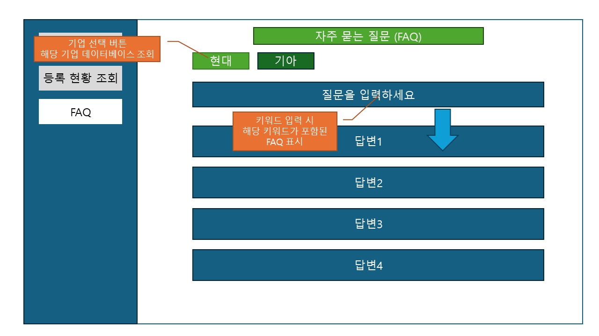
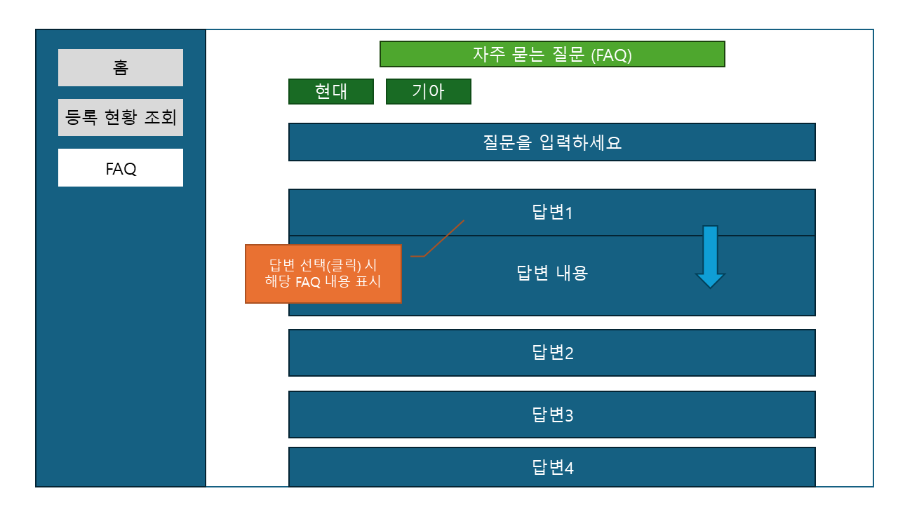

# SKN12-1ST-4TEAM 🚀

## 프로젝트 소개 🚀

### 🚗 자동차 등록은 왜 해야 하는 걸까?

우리는 그 이유에 대해 주목했습니다.  

물론 기능 구현은 기본이고 말이죠 😉  

📌 **우리를 내내 힘들게 했던 데이터의 정렬, 정렬, 정렬... 😭**  

---

## 🚘 자동차 등록 현황이 어디에 쓰이는지 알고 계신가요? 🤔❓

**환경, 세수 확보, 교통정보, 교통량 예측 등...**  
생각보다 많은 곳에서 활용되고 있었습니다. 💡  

> **그 결과, 자동차 등록 현황이
> 우리가 상식적으로 갖고 있는 인구 밀집도와 비슷한 결과를 보인다는 걸 알게 됐죠!** ❗  

---

## 🌍 세계 곳곳에서 사용되고 있는 자동차 등록 현황! 🚗🚒🚌🚓

국토통계와 나라지표를 통해  
우리나라의 자동차 등록 현황에 대해서도 알아볼까요? 🏃‍♂️  

---

# 🎈 팀원 소개

| 팀원 1 | 팀원 2 | 팀원 3 | 팀원 4 | 팀원 5 |
|:------:|:------:|:------:|:------:|:------:|
| ![팀원이미지1] | ![팀원이미지2] | ![팀원이미지3] | ![팀원이미지4] | ![팀원이미지5] |
| 이석원 | 이용규 | 이정민 | 이준석 | 박슬기 |
| StreamLit | Crawling | Crawling | Mapping | PM, Crawling |  

---

# 🎯 프로젝트 목표

## ✅ 자동차 등록 현황의 시각화

- ✅ 자동차 등록 현황 데이터 크롤링  

- ✅ 등록 현황 데이터의 차트 및 지도 표현  

---

# 📌 구상 및 기획

## 📊 국토교통 통계누리 및 E-나라지표 데이터 크롤링  

국도교통 통계누리

E-나라지표

## 🗺️ 시각적으로 볼 수 있는 차트 및 지도 자료 첨부  

![지도 이미지]  

## 📝 화면 설계서 작성  

---

# 🛠 사용한 툴

---

# 🏗 ERD 구조  

![ERD 구조 이미지]  

---

# 🎬 프로젝트 결과 (StreamLit UI)  

![UI 이미지1]  

![UI 이미지2]  

![UI 이미지3]  

![UI 이미지4]  
